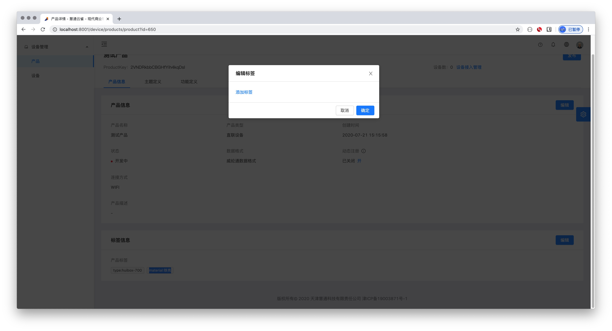
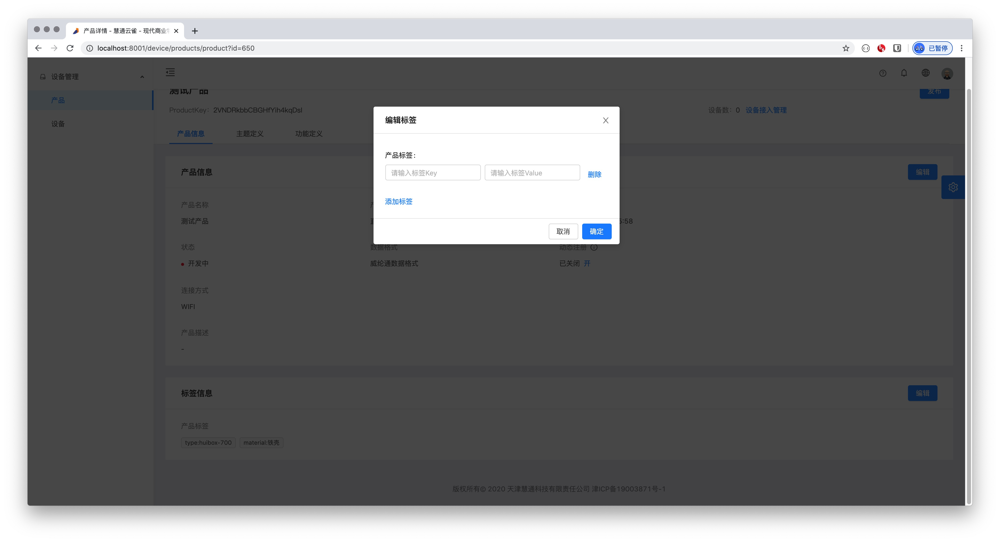
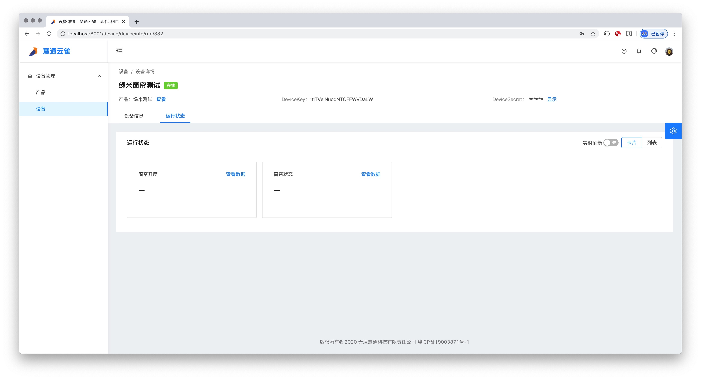
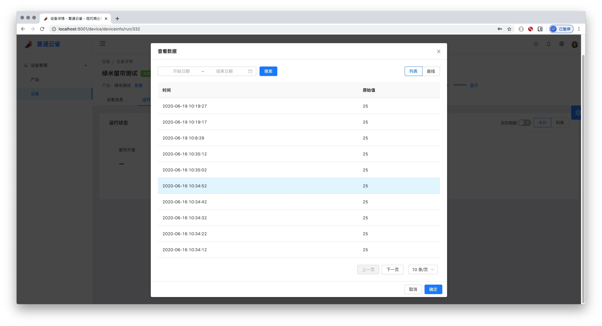

# 5.2 设备详情

* 产品管理页的上方包含设备名称，DeviceKey，DeviceSecret，设备数和发布/撤回按钮以及三个标签页：产品信息，主题定义和功能定义
    * 出于安全考虑，DeviceSecret默认为隐藏，点击显示后，会弹出对话框，对话框上有ProductKey, DeviceKey,DeviceSecret，如下图：
    
    * 重置 DeviceSecret 后将导致原有 DeviceSecret 失效，您需要将新生成的 DeviceSecret 烧录到设备中。
    
## 5.2.1 设备信息页
### 设备信息
* 设备信息块有设备信息，设备类型，创建时间，在线状态（已激活和未激活），固件版本，最后上线时间，激活时间和最后下线时间
* 点击编辑弹出编辑对话框，可以修改设备名称

### 标签信息
* 标签信息块会展示设备的标签，默认标签有“type:huibox-700“和“material:铁壳“。
* 点击编辑弹出编辑对话框，可以增加设备的标签。

* 点击增加标签，可以填写标签键和值。

* 填写完成后点击确认即可增加设备的标签。

## 5.2.2 运行状态
### 状态列表
* 运行状态下会显示产品中所定义的功能的数据，展示方式有卡片和列表两种方式。如下图：
    * 卡片
    
    * 列表
    
    
### 查看数据
* 点击卡片上的查看数据或列表的操作下的查看数据，会展示详细的数据。展示方式支持列表和曲线两种方式
    * 列表
    
    * 曲线
    
    * 详细数据支持按时间跨度搜索，选择好时间范围后，点击搜索即可。
    
### 实时刷新
* 打开实时刷新后，系统会每隔一段时间自动拉取最新数据。

## 5.2.3 设备影子
* 用户需要自定义设备数据时，需要通过设备影子来写入数据(未激活设备无法写入)
    
    * 点击更新设备影子，弹出更新设备影子对话框，如下图：
      
      * 更新设备影子的数据分为两种：设备上报属性和设备期望属性。设备上报属性是定义设备上报的数据，设备期望属性是设置设备处于离线状态时的期望属性。
      
      * 每行左边选项框可选择设备的数据类型，右边输入所选类型的值。（可选的设备数据类型在产品的功能定义下定义）
      
      
## 5.2.4 子设备管理
* 只有网关会有子设备

### 添加子设备
* 添加子设备需要选择产品名称（从已有产品中选择）和子设备名称（从已有设备中选择）。

### 子设备搜索

* 产品搜索支持设备名称或DeviceKey搜索，选择搜索方式后，输入搜索内容，点击搜索即可。

### 查看子设备
* 点击操作下的查看按钮，会跳转到设备详情页，[点击](/device/deviceDetail.html#_5-2-1-设备信息页 "设备信息页")查看具体内容。

### 子设备删除
* 点击操作下的删除按钮，会弹出删除确认框，点击确认即可删除。

### 子设备批量删除

* 勾选需要删除的设备，点击左下角的删除按钮，弹出确认框点击确认后即可批量删除设备
