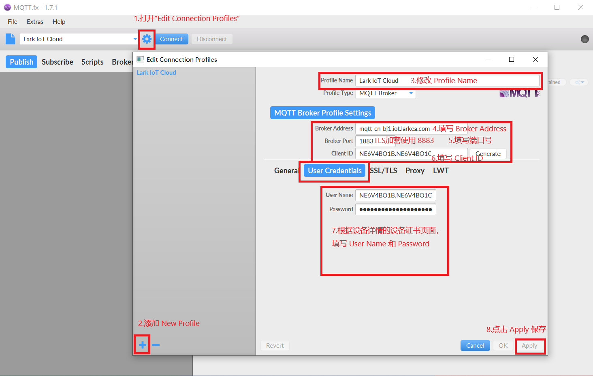

# 10.1 使用 MQTT.fx 接入物联网通信云平台

本示例介绍一个完整的利用物联网通信云平台（Lark IoT Cloud）实现应用程序与平台设备的消息上报。

示例基于模拟客户端 MQTT.fx，该软件免费使用，可以在其[官方网站下载](http://mqttfx.jensd.de/index.php/download)，本示例使用的版本是 1.7.1。

## 前提条件

1. 参考[平台注册](/login/register.html)、[用户登录](/login/login.html)、[产品管理](/product/create.html)、[设备管理](/device/deviceManage.html)，创建可供连接的设备。
   
   * 产品的节点类型选择直联设备或者网关设备，具体原因请参考[节点类型](/develop/NodeType.html)。
   
2. 参考[设备详情](/device/deviceDetail.html)，获取 ProductKey、DeviceKey、DeviceSecret：

   ```
   ProductKey：NE6V4BO1B
   DeviceKey：NE6V4BO1C
   DeviceSecret：4gzd4Zi5gA0jzpEZiwLe
   ```
## MQTT.fx 客户端连接平台

1. 建立连接，本例以[静态注册](/develop/deviceRegistration.html)的方式建立连接。

   1）根据静态连接获取到MQTT登录需要的三要素：`ClientID`，`UserName`，`Password`。

   

   | MQTT认证参数 |                     **参数值**                      |
   | :----------: | :-------------------------------------------------: |
   |  Client ID   | NE6V4BO1B.NE6V4BO1C，规则：{ProductKey}.{DeviceKey} |
   |  User Name   | NE6V4BO1B.NE6V4BO1C，规则：{ProductKey}.{DeviceKey} |
   |   Password   |     4gzd4Zi5gA0jzpEZiwLe，规则：{DeviceSecret}      |

   * 注：{ProductKey}.{DeviceKey} 中间的 `.` 不要忘记，也可以选择设备证书里面的 `复制 ClientId/User Name` ，即可复制所需的 ClientId/User Name，如下图所示

     

   2）参考[设备连接](/develop/deviceLink.html)，获取 MQTT Broker 连接域名和 TLS CA 证书：

   

   |        Broker参数        |                          **参数值**                          |
   | :----------------------: | :----------------------------------------------------------: |
   |      Broker Address      |   mqtt-cn-bj1.iot.larkea.com（请根据实际的服务器地址更换）   |
   |       Broker Port        |                    1883 或 8883(使用TLS)                     |
   |        KeepAlive         | 30秒-1200秒，建议设置为 300秒。 **当出现连接出错时，需要仔细检查该参数。** |
   | TLS(CA Certificate file) |               [CA 证书 下载地址](/../.vuepress/public/certificate/larkea.crt)               |

   3）打开MQTT.fx软件，连接成功 按照下图的顺序依次输入相应的参数值。 - 输入Broker Address、Broker Port、Client ID - 输入User Name、 Password - 输入TLS证书，可以不使用TLS连接，端口为1883 - 点击 Apply 应用 - 点击 Connect 进行连接。

   

   ```
      - 勾选 Enable SSL/TLS
      - 输入 TLS 证书的路径，即 larkea.crt 的路径（使用 1883 端口，即不使用 TLS 加密，跳过此步）：
   ```

   

2. 选择设置好的 Profile，点击 Connect 连接。

   

   

3. 如图，MQTT.fx 客户端绿灯代表连接成功，此时平台对应设备的状态也是在线的。

   
   
   

## 通过 MQTT.fx 客户端给平台上报消息

1. 首先，要在平台产品页面定义一个功能，也就是需要传到平台的数据类型，产品的功能定义请参考[产品详情](product/productManage.html)和[物模型](develop/ObjectModel.html)。

   * 这里就以温度为例，功能类型是属性（决定了后面使用的主题），标识符是 TP（决定了上传消息的内容），名称是 Temperature，数据类型是整形，取值范围是 0 - 50，步长是1，单位是℃，权限只读。

     

     

2. 在 MQTT.fx 客户端，需要填入主题和消息，主题和消息格式都请参考[接入协议](protocol/protocol.html)。

   * 此处的主题为设备上报属性，其中的 {productKey}/{deviceKey} 需替换为设备的 productKey/deviceKey 即图中的 pk/dk ，注：productKey 和 deviceKey 中间有 `/`。

     ```
     /sys/NE6V4BO1B/NE6V4BO1C/thing/property/post
     ```
     
   * 消息的内容是之前功能定义里面的标识符。
        ```
        {  
            "properties" : {   
                "TP" : 24
            }
        }
        ```

           
   

3. 设备运行状态和 MQTT.fx 的日志都显示成功。

   