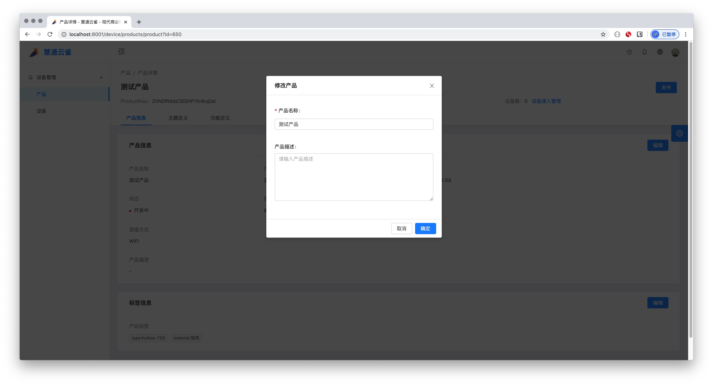
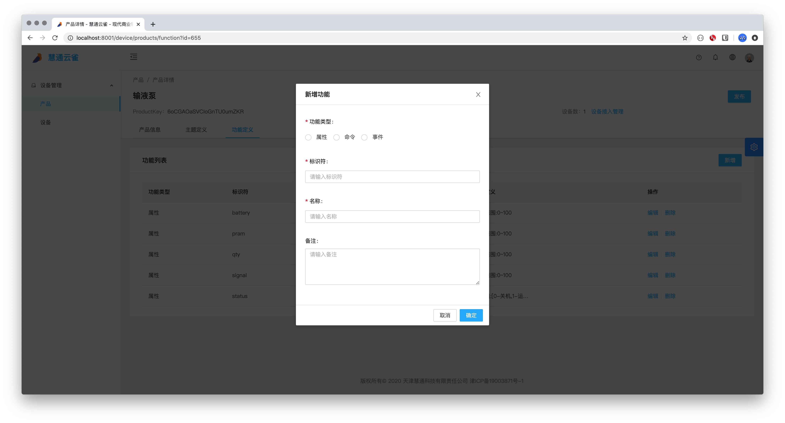
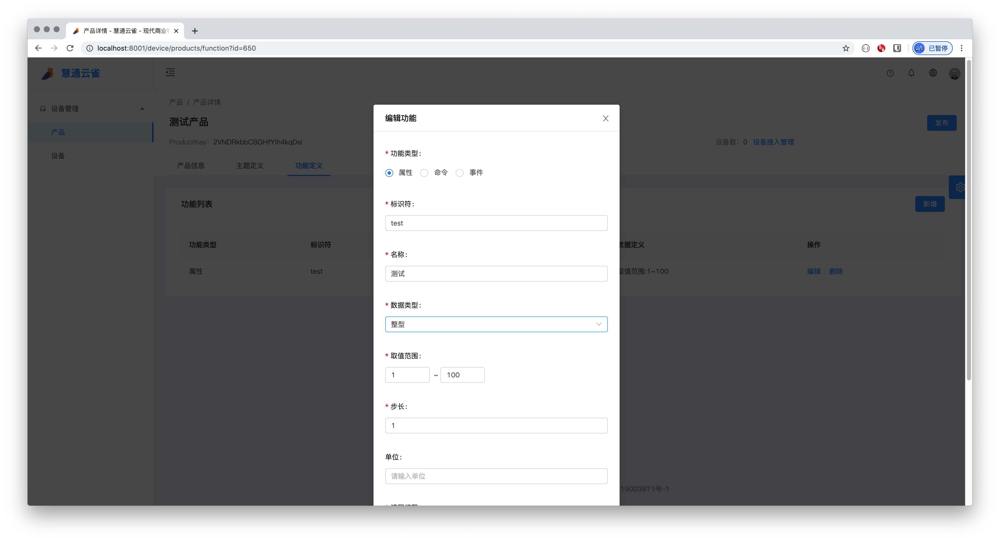

# 4.2 产品详情

* 产品管理页的上方包含产品名称，ProductKey，ProductSecret，设备数和发布/撤回按钮以及三个标签页：产品信息，主题定义和功能定义
    * 出于安全考虑，productSecret默认为脱敏，点击productSecret的显示按钮，可以显示ProductSecret，如下图：
    
    * 点击设备接入设备管理按钮，会跳转到设备列表处，[点击](/device/deviceManage.html#_5-1-1-设备列表 "设备列表")查看设备列表详情。
    * 点击发布按钮，会发布设备，设备状态会切换到已发布。点击撤回按钮，会撤回设备，设备状态会切换到开发中。
    * 显示ProductSecret后，页面上会多出一个重置按钮，重置后将导致原有ProductSecret失效，需要将新生成的ProductSecret烧录到设备中。

## 4.2.1 产品信息页
### 产品信息
* 产品信息块有产品信息，产品类型，创建时间，状态（已发布或开发中），数据格式，动态注册，连接方式和描述
* 点击编辑弹出编辑对话框，可以修改产品名称和产品描述

### 标签信息
* 标签信息块会展示产品的标签，默认标签有“type:huibox-700“和“material:铁壳“。
* 点击编辑弹出编辑对话框，可以增加产品的标签。

* 点击增加标签，可以填写标签键和值。

* 填写完成后点击确认即可增加产品的标签。

## 4.2.2 产品主题定义
### 默认主题

* 新创建的产品，都带有系统默认的一些主题，不可编辑不可删除，如下图：

### 新增主题
* 点击新增按钮， 弹出新增主题的对话框

* 主题和设备权限为必选，备注为可选
    * 设备权限有三种：发布，订阅以及发布和订阅

### 编辑主题

#### 只有自定义的主题可以编辑与删除，系统默认主题不可修改与删除

* 点击编辑按钮，弹出编辑主题对话框，可以修改主题，设备权限和备注

### 删除主题

* 点击删除按钮，弹出删除确认框，点击确定即可删除自定义主题

## 4.2.3 功能定义

* 功能定义页面展示用户自定义的一些功能，功能主要有三类：属性，命令和事件。

### 新增功能

* 根据用户选择功能类型的不同，所需填写的参数也会跟着变化
    * 属性
        * 当用户选择的功能为属性时，所需填写的参数有标识符，名称，数据类型和读写权限，备注为可选参数。如下图
         
        * 其中数据类型有整型，长整型，单精度浮点型，双精度浮点型，布尔型，枚举型，字符型和时间型。根据用户所选的数据类型不同，所需填写的参数也不同。
            * 当所选数据类型为整型，长整型，单精度浮点型和双精度浮点型时，需要填写取值范围（最小值到最大值），布长（精度）和单位。其中单位为可选参数，如下图：
            
            * 当所选数据类型为布尔型时，需要填写BOOL值所对应的值。如下图：
            
            * 当所选数据类型为枚举型时，可以任意添加枚举项（一个值对应一个描述）。如下图：
            
            * 当所选数据类型为字符串时，需要设置字符串的长度（1 - 2048）。如下图：
            
            * 当所选数据类型为时间型时，可以设置格式，例如： yyyy-MM-dd T HH:mm:ss.SSSZ, 输出结果将为：2015-02-12 T 17:08:49.682+0800。如果没设置时间格式，默认为时间戳。如下图：
            
    * 命令
        * 当用户选择的功能为命令时，所需填写的参数有标识符，名称，调用方式和读写权限，可选参数有输入参数，输出参数和备注。如下图
         
            * 点击添加输入参数会弹出对话框，所需填写的参数有标识符，名称，数据类型（数据类型具体操作同上文所描述）。备注为可选参数。如下图：
             
            * 点击添加输出参数会弹出对话框，所需填写的参数有标识符，名称，数据类型（数据类型具体操作同上文所描述）。备注为可选参数。如下图：
             
    * 事件
        * 当用户选择的功能为事件时，所需填写的参数有标识符，名称，事件类型，可选参数有输出参数和备注。如下图
        
            * 点击添加输出参数会弹出对话框，所需填写的参数有标识符，名称，数据类型（数据类型具体操作同上文所描述）。备注为可选参数。如下图：
             
                 
### 编辑功能

* 点击操作下的编辑按钮，会弹出编辑对话框，编辑对话框内容同新增一致，[点击](/product/productManage.html#新增功能 "新增功能")查看具体内容

### 删除功能

* 点击操作下的编删除按钮，会弹出删除确认框，点击确认即可删除
