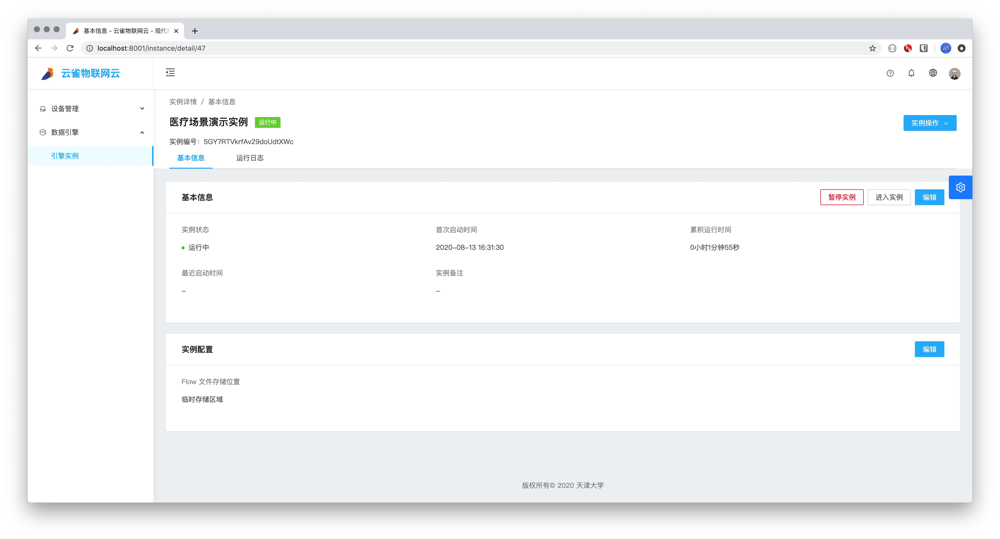
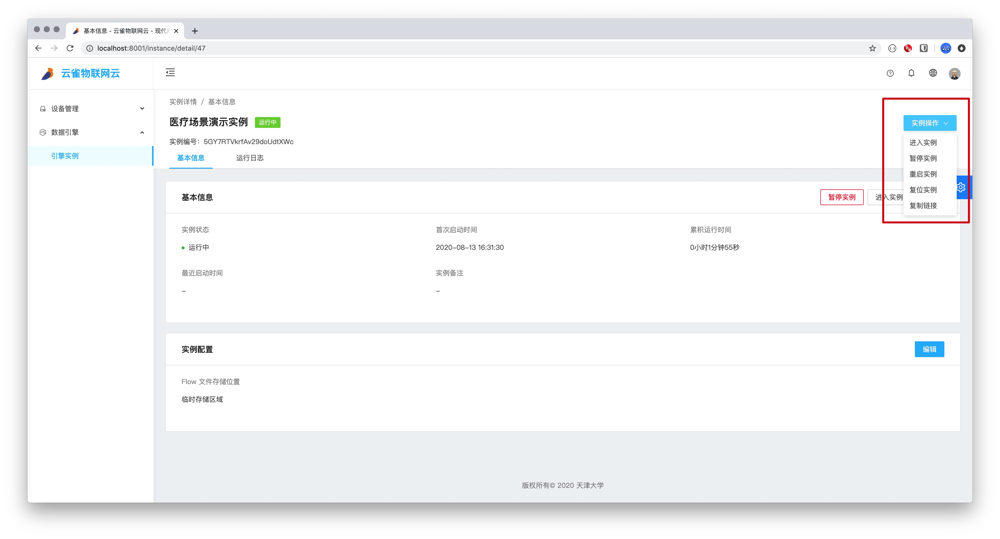
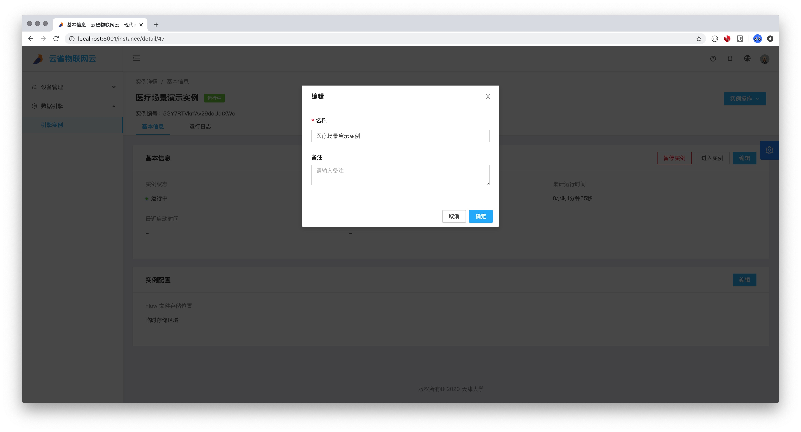
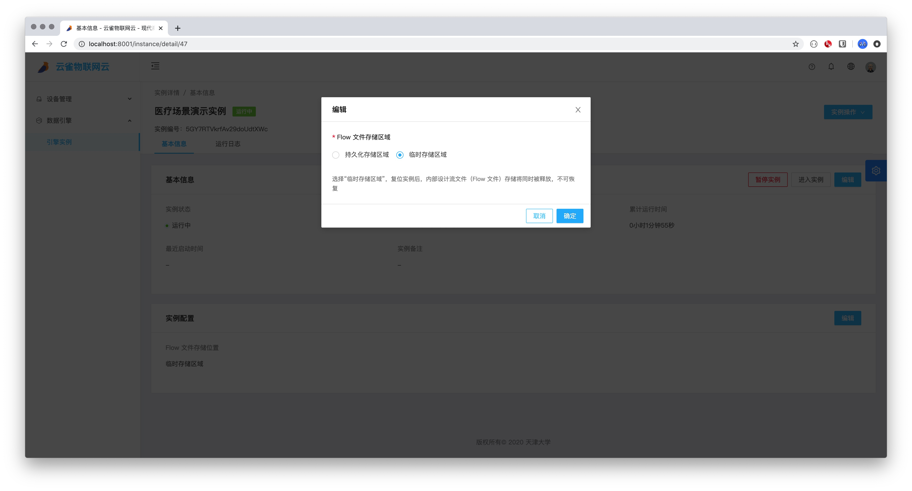
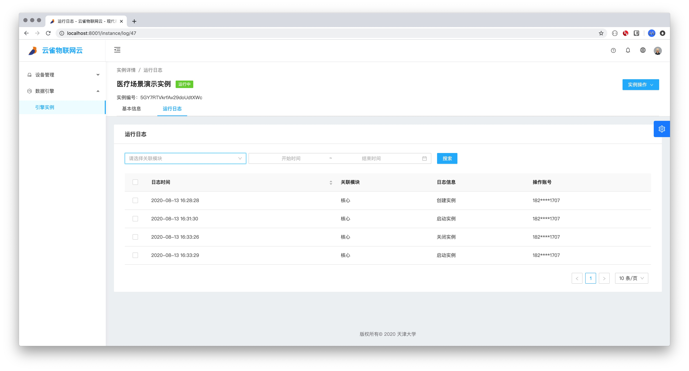

# 7.2 实例详情

### 实例操作

* 进入实例
  * 点击进入实例，会跳转到node-Red操作页面，如果实例状态为未启动则不可点击，需先启动实例后，才可点击。
* 启动/暂停实例
  * 点击启动实例或暂停实例，可以启动或暂停实例。
* 重启实例
  * 点击重启实例会将实例重启，如果实例状态为未启动则不可点击，需先启动实例后，才可点击。
* 复位实例
  * 点击复位实例会将实例复位。
* 复制链接
  * 点击复制链接会复制实例node-red网址。

## 基本信息
* 基本信息页分为两部分：基本信息和实例配置。基本信息包含实例状态，首次启动时间。累积运行时间。最近启动时间和实例备注。实例配置包含Flow 文件存储区域。

### 编辑基本信息

* 点击编辑按钮，弹出实例基本信息编辑对话框，可以修改实例的名称和备注。

### 进入实例
* 点击进入实例按钮，会跳转到node-Red操作页面，如果实例状态为未启动则不可点击，需先启动实例后，才可点击。

###  启动/暂停实例
* 点击启动实例或暂停实例，可以启动或暂停实例。

### 编辑实例配置

* 点击编辑按钮，弹出实例配置编辑对话框，可以选择是Flow文件存储位置：持久化存储区域和临时存储区域。注：选择“临时存储区域”，复位实例后，内部设计流文件（Flow 文件）存储将同时被释放，不可恢复。

## 实例运行日志

* 实例运行日志中会列举出实例的所有操作（创建，编辑，启动，暂停，重启，复位），可以根据模块（核心和配置）和时间来搜索实例的运行日志