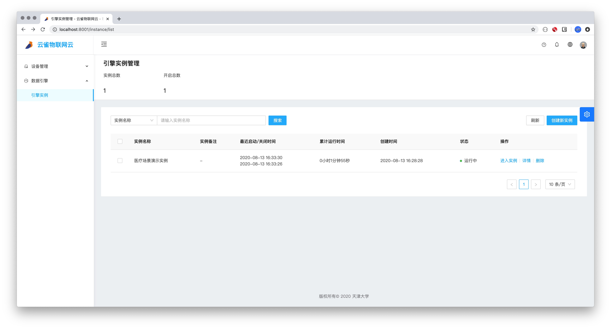
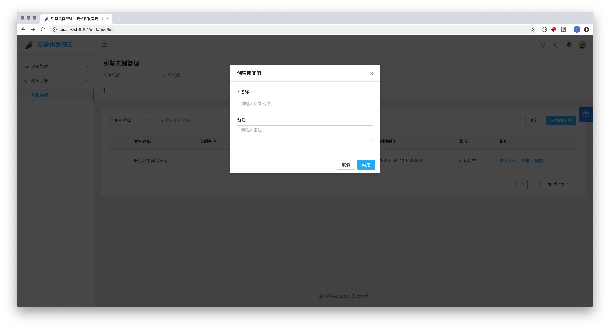

# 7.1 引擎实例管理
## 7.1.1 实例列表

### 实例创建

* 创建实例需要填写名称好备注，名称为必填，备注为可填。填写完成后点击确认即可创建。

### 进入实例
* 点击进入实例会进入当前实例的node-Red编辑页面，如果实例的状态为未启动状态，则系统会提示您启动实例，成功启动后才可进入操作页面。

### 详情
* 点击详情会跳转到实例详情页面。

### 删除
* 点击删除，系统弹出确认框，点击确认即可删除。如果实例的状态为运行状态，则系统会提示您暂停实例，成功暂停后才可进行删除操作。